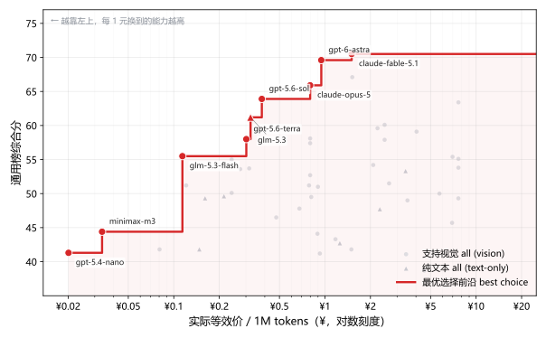
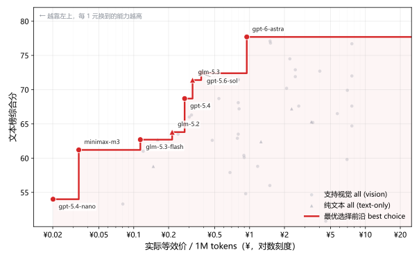

# AI 前沿模型排行

聚合 LiveBench、DeepSWE、EQ-Bench、Artificial Analysis 四个独立评测源的大模型排行榜，从各厂商里挑出旗舰模型做三张榜：通用能力、写作能力、以及把订阅套餐折算成等效单价的性价比对比。价格同时给出美元与人民币（实时汇率），每月随上游数据自动更新。选型场景以 AI 编程为主，兼顾日常问答与写作；模型数量控制在四十多个旗舰，完整名单见下方快照。

## 能力-成本曲线：预算多少，买哪个模型

每个点是一个模型：横轴是实际支付价（最优订阅套餐折算后的等效价，无订阅厂商即官方按量混合价；人民币、对数刻度），纵轴是通用榜综合分。红色阶梯线是最优选择前沿——在横轴上定位你的预算，前沿在该处的高度就是这笔预算能买到的最强模型（例如预算约 ¥0.5/M 时是 gpt-5.6-sol，¥1.5/M 时已是 claude-fable-5）。

<!--FRONTIER_START-->

<!--FRONTIER_END-->

## 这个榜单怎么做

大多数公开榜单要么只看一家的合成指数，要么把几百个长尾模型堆在一起凑数。这里的做法不同：

- 只收国际和国内主流厂商的旗舰（约 40 个）。长尾模型没人用，堆着只会稀释参考价值。
- 四个独立源交叉聚合：LiveBench、DeepSWE、EQ-Bench、Artificial Analysis。单一来源有偏见，交叉验证更可信。
- 固定锚点打分：按指标理论范围换算 0–100 分，不做「样本第一 = 100」的名次分。加新模型不影响已有分数，分数反映真实差距。
- 美元与人民币双币价，汇率每次构建实时抓取。

## 通用榜 Top 15

编程、智能体、日常混合使用看这张。权重：编码 25%、Agent 25%、指令遵循 15%、长上下文 10%、事实 15%、知识 10%。

<!--SNAPSHOT_GENERAL_START-->
> 2026-09-06 抓取（50 精选模型 -> 50 行）。
> 填补验证：Terminal-Bench v2.1 MAE=0.03 (>10%: 8.7%/46) ; DeepSWE MAE=5.43 (>10%: 28.6%/28) ; LiveBench Coding MAE=3.27 (>10%: 6.2%/48) ; tau3-Banking MAE=0.05 (>10%: 56.5%/46) ; LiveBench Agentic Coding MAE=2.99 (>10%: 22.9%/48) ; LiveBench Instruction Following MAE=5.51 (>10%: 33.3%/48) ; LCR MAE=0.02 (>10%: 2.0%/50) ; IFBench MAE=0.08 (>10%: 48.0%/25) ; HLE MAE=0.03 (>10%: 20.0%/50) ; SciCode MAE=0.02 (>10%: 0.0%/36) ; LiveBench Reasoning MAE=3.15 (>10%: 4.2%/48) ; Omniscience Index MAE=9.12 (>10%: 88.0%/50)
<!--SNAPSHOT_GENERAL_END-->

<!--TOP15_GENERAL_START-->
| # | Model | Creator | Vision | Score | Imputed |
|---|---|---|---|---|---|
| 1 | claude-fable-5.1 | Anthropic | 👁️ | 76.0 | DeepSWE(reg), BrowseComp(reg), IFBench(reg) |
| 2 | gpt-6-astra | OpenAI | 👁️ | 74.4 | IFBench(reg) |
| 3 | claude-opus-5 | Anthropic | 👁️ | 72.8 | IFBench(reg) |
| 4 | claude-fable-5 | Anthropic | 👁️ | 72.4 | BrowseComp(reg) |
| 5 | muse-spark-1.3 | Meta | 👁️ | 71.2 | DeepSWE(reg), BrowseComp(reg), IFBench(reg) |
| 6 | kimi-k3 | Moonshot AI | 👁️ | 70.8 | IFBench(reg) |
| 7 | gemini-3.8-flash | Google | 👁️ | 70.7 | BrowseComp(reg), IFBench(reg) |
| 8 | gpt-5.6-sol | OpenAI | 👁️ | 70.3 | BrowseComp(reg) |
| 9 | grok-4.6 | xAI | 👁️ | 69.4 | BrowseComp(reg), IFBench(reg) |
| 10 | gemini-3.7-flash | Google | 👁️ | 68.7 | BrowseComp(reg), IFBench(reg) |
| 11 | gpt-5.5 | OpenAI | 👁️ | 67.6 | BrowseComp(reg), SciCode(reg) |
| 12 | glm-5.3 | Z.AI | - | 67.4 | BrowseComp(reg), IFBench(reg) |
| 13 | claude-opus-4.8 | Anthropic | 👁️ | 66.3 | BrowseComp(reg) |
| 14 | muse-spark-1.2 | Meta | 👁️ | 65.7 | BrowseComp(reg), IFBench(reg) |
| 15 | gpt-5.6-terra | OpenAI | 👁️ | 65.3 | BrowseComp(reg) |
<!--TOP15_GENERAL_END-->

[完整排名 CSV](results/general_scored.csv)

## 文本榜 Top 15

适用于文学创作、长篇阅读、专业案头分析与日常问答。评测覆盖 5 个维度：创意文学（25%）、专业案头（20%）、指令约束（20%）、事实与长文本（20%）、人际心智（15%），不包含代码生成与数理考试指标。图表纵轴为文本榜综合分，横轴为百万 token 成本，用于按预算选型。

<!--TEXT_FRONTIER_START-->

<!--TEXT_FRONTIER_END-->

<!--SNAPSHOT_TEXT_START-->
> 2026-09-06 抓取（50 精选模型 -> 50 行）。
> 填补验证：EQ-Bench 4 MAE=77.47 (>10%: 22.2%/18) ; LiveBench StoryGen MAE=4.69 (>10%: 22.9%/48) ; LiveBench Language MAE=3.45 (>10%: 8.3%/48) ; GDPval-AA MAE=0.06 (>10%: 65.2%/46) ; AA Briefcase MAE=53.04 (>10%: 0.0%/11) ; LiveBench Summarize MAE=6.58 (>10%: 37.5%/48) ; IFBench MAE=0.08 (>10%: 48.0%/25) ; LiveBench Instruction Following MAE=5.51 (>10%: 33.3%/48) ; LiveBench Simplify MAE=5.94 (>10%: 37.5%/48) ; Omniscience Index MAE=9.12 (>10%: 88.0%/50) ; LCR MAE=0.02 (>10%: 2.0%/50) ; Omniscience Non-Halluc. MAE=0.20 (>10%: 92.0%/50) ; LiveBench Theory of Mind MAE=1.81 (>10%: 2.1%/48) ; CritPt MAE=0.03 (>10%: 54.0%/50)
<!--SNAPSHOT_TEXT_END-->

<!--TOP15_TEXT_START-->
| # | Model | Creator | Vision | Score | Imputed |
|---|---|---|---|---|---|
| 1 | claude-fable-5.1 | Anthropic | 👁️ | 72.3 | EQ-Bench 4(reg), IFBench(reg), DeepSearchQA(reg) |
| 2 | muse-spark-1.3 | Meta | 👁️ | 70.9 | EQ-Bench 4(reg), IFBench(reg) |
| 3 | gpt-6-astra | OpenAI | 👁️ | 70.8 | EQ-Bench 4(reg), IFBench(reg), DeepSearchQA(reg) |
| 4 | kimi-k3 | Moonshot AI | 👁️ | 70.7 | IFBench(reg) |
| 5 | grok-4.6 | xAI | 👁️ | 68.9 | EQ-Bench 4(reg), IFBench(reg), DeepSearchQA(reg) |
| 6 | claude-fable-5 | Anthropic | 👁️ | 68.7 | EQ-Bench 4(reg), AA Briefcase(reg), DeepSearchQA(reg) |
| 7 | gemini-3.8-flash | Google | 👁️ | 67.7 | EQ-Bench 4(reg), AA Briefcase(reg), IFBench(reg), DeepSearchQA(reg) |
| 8 | gpt-5.6-sol | OpenAI | 👁️ | 67.1 | DeepSearchQA(reg) |
| 9 | claude-opus-4.8 | Anthropic | 👁️ | 66.5 | AA Briefcase(reg) |
| 10 | claude-opus-5 | Anthropic | 👁️ | 66.4 | EQ-Bench 4(reg), IFBench(reg) |
| 11 | gemini-3.7-flash | Google | 👁️ | 66.3 | EQ-Bench 4(reg), AA Briefcase(reg), IFBench(reg), DeepSearchQA(reg) |
| 12 | glm-5.3 | Z.AI | - | 66.0 | EQ-Bench 4(reg), IFBench(reg), DeepSearchQA(reg) |
| 13 | gpt-5.5 | OpenAI | 👁️ | 66.0 | AA Briefcase(reg), DeepSearchQA(reg) |
| 14 | muse-spark-1.2 | Meta | 👁️ | 65.6 | EQ-Bench 4(reg), AA Briefcase(reg), IFBench(reg), DeepSearchQA(reg) |
| 15 | qwen3.8-max | Alibaba | 👁️ | 65.3 | EQ-Bench 4(reg), AA Briefcase(reg), IFBench(reg), DeepSearchQA(reg) |
<!--TOP15_TEXT_END-->

[完整排名 CSV](results/text_scored.csv)

## 性价比榜 Top 15

回答「买哪个套餐最划算」。行序跟通用榜一致——按性价比排会让便宜小模型霸榜，没有决策价值。各列含义：API $/1M 是官方按量混合价（含缓存命中假设）；套餐内 $/1M 是该厂商最优订阅折算后的等效价；倍率是每 1 元月费换到的 API 等价额度，70× 即 $1 月费约换 $70 额度；Value = 综合分 ÷ 套餐内 $/1M。套餐名就是官方购买链接，没有订阅制的厂商按 API 按量计费（1×）。

<!--SNAPSHOT_VALUE_START-->
> 2026-09-06 抓取（50 精选模型 -> 50 行）。
> 填补验证：Terminal-Bench v2.1 MAE=0.03 (>10%: 8.7%/46) ; DeepSWE MAE=5.43 (>10%: 28.6%/28) ; LiveBench Coding MAE=3.27 (>10%: 6.2%/48) ; tau3-Banking MAE=0.05 (>10%: 56.5%/46) ; LiveBench Agentic Coding MAE=2.99 (>10%: 22.9%/48) ; LiveBench Instruction Following MAE=5.51 (>10%: 33.3%/48) ; LCR MAE=0.02 (>10%: 2.0%/50) ; IFBench MAE=0.08 (>10%: 48.0%/25) ; HLE MAE=0.03 (>10%: 20.0%/50) ; SciCode MAE=0.02 (>10%: 0.0%/36) ; LiveBench Reasoning MAE=3.15 (>10%: 4.2%/48) ; Omniscience Index MAE=9.12 (>10%: 88.0%/50)
<!--SNAPSHOT_VALUE_END-->

<!--TOP15_VALUE_START-->
| # | Model | Creator | Vision | Score | API $/1M | 套餐 | 月费 | 倍率 | 套餐内 $/1M | 套餐内 ¥/1M | Value |
|---|---|---|---|---|---|---|---|---|---|---|---|
| 1 | claude-fable-5.1 | Anthropic | 👁️ | 76.0 | 8.956 | [Claude Max 20x](https://claude.com/pricing) | $200 | 40× | 0.224 | 1.504 | 339.19 |
| 2 | gpt-6-astra | OpenAI | 👁️ | 74.4 | 9.88 | [ChatGPT Pro 20x](https://chatgpt.com/pricing) | $200 | 70× | 0.141 | 0.946 | 527.85 |
| 3 | claude-opus-5 | Anthropic | 👁️ | 72.8 | 4.749 | [Claude Max 20x](https://claude.com/pricing) | $200 | 40× | 0.119 | 0.799 | 611.92 |
| 4 | claude-fable-5 | Anthropic | 👁️ | 72.4 | 9.059 | [Claude Max 20x](https://claude.com/pricing) | $200 | 40× | 0.226 | 1.517 | 320.55 |
| 5 | muse-spark-1.3 | Meta | 👁️ | 71.2 | 1.139 | API 按量 | - | 1× | 1.139 | 7.646 | 62.54 |
| 6 | kimi-k3 | Moonshot AI | 👁️ | 70.8 | 2.734 | [Kimi 会员 Allegretto](https://www.kimi.com/membership/pricing) | $27.6 | 4.5× | 0.602 | 4.041 | 117.68 |
| 7 | gemini-3.8-flash | Google | 👁️ | 70.7 | 0.741 | [GitHub Copilot Max](https://github.com/features/copilot/plans) | $100 | 2× | 0.37 | 2.484 | 191.02 |
| 8 | gpt-5.6-sol | OpenAI | 👁️ | 70.3 | 3.952 | [ChatGPT Pro 20x](https://chatgpt.com/pricing) | $200 | 70× | 0.057 | 0.383 | 1233.89 |
| 9 | grok-4.6 | xAI | 👁️ | 69.4 | 1.771 | [SuperGrok Heavy](https://x.ai/pricing) | $300 | 5.3× | 0.332 | 2.229 | 209.12 |
| 10 | gemini-3.7-flash | Google | 👁️ | 68.7 | 0.741 | [GitHub Copilot Max](https://github.com/features/copilot/plans) | $100 | 2× | 0.37 | 2.484 | 185.67 |
| 11 | gpt-5.5 | OpenAI | 👁️ | 67.6 | 5.69 | [ChatGPT Pro 20x](https://chatgpt.com/pricing) | $200 | 70× | 0.081 | 0.544 | 835.09 |
| 12 | glm-5.3 | Z.AI | - | 67.4 | 1.65 | [GLM Coding Plan Max](https://bigmodel.cn/glm-coding) | $149.7 | 34.4× | 0.048 | 0.322 | 1403.63 |
| 13 | claude-opus-4.8 | Anthropic | 👁️ | 66.3 | 4.749 | [Claude Max 20x](https://claude.com/pricing) | $200 | 40× | 0.119 | 0.799 | 556.88 |
| 14 | muse-spark-1.2 | Meta | 👁️ | 65.7 | 1.139 | API 按量 | - | 1× | 1.139 | 7.646 | 57.68 |
| 15 | gpt-5.6-terra | OpenAI | 👁️ | 65.3 | 3.133 | [ChatGPT Pro 20x](https://chatgpt.com/pricing) | $200 | 70× | 0.045 | 0.302 | 1450.26 |
<!--TOP15_VALUE_END-->

[完整排名 CSV](results/value_scored.csv)

Imputed 列：`-` 表示全部真实值，`指标(reg)` 是岭回归填补，`指标(reg,low)` 是低可信填补。性价比榜完整 CSV 里还有 `Blended $/1M`（无折扣混合价）和 `Plan Monthly / Multiplier / Discount / URL` 等套餐明细列。

## 套餐购买指南

按订阅维度直接对比「买哪家最值」。每个套餐取它覆盖的厂商里通用榜最强的模型，按「套餐内 Value = 最强模型分 ÷ 该套餐下等效价」从高到低排。这个排法同时反映两件事：套餐能用到多强的模型、折算后到底多便宜，不是单纯比谁额度大。

各列口径：

- 倍率 = 每 1 元月费换到的 API 等价额度；折扣 = 套餐内单价 ÷ 官方单价
- ≈Token/月：官方公布了 token 池的直接引用（MiniMax、GLM、混元、MiMo）；没公布的按「API 等价价值 ÷ 最强模型官方混合价」估算，即额度全部用于该模型时的量，实际用便宜模型能换到更多

数据来源与时点：ChatGPT / Claude 倍率来自 SemiAnalysis 2026-06 实测，Copilot 是 GitHub 官方额度，Grok 为 agentplans.fyi 2026-06 估算，Kimi 为社区实测，国内各家为 2026-08 官方页面实查，聚合与 IDE 类（OpenCode Go、Factory、Trae、Cursor）为 awesome-coding-plan 2026-08 第三方实测。倍率一律按用满额度上限计算，轻度用户实际拿不到这么多。国内套餐标价为人民币，¥/月 按实时汇率折算。

积分制套餐没有倍率。千问 Token Plan 和 WorkBuddy 官方都没公布 Credits 换 token 的系数，社区两套口径相差 5 到 10 倍，给数字等于编数，所以只列官方积分额度；WorkBuddy 的 token 量按社区实测「1 积分 ≈ 4,100 token」折了个大概，仅供参考。

两个例外。Gemini 官方订阅不含 API 额度，不进表，编程需求可以由 GitHub Copilot 覆盖；DeepSeek 没有自有订阅制，由腾讯云 Hy Token Plan Standard 聚合池提供第三方折扣（详见 FAQ）。

<!--PLANS_GUIDE_START-->
| # | 套餐 | 月费 | ¥/月 | 倍率 | 折扣 | ≈Token/月 | 最强模型（通用榜） | 模型分 | 套餐内 $/1M | Value |
|---|---|---|---|---|---|---|---|---|---|---|
| 1 | [MiniMax Max Token Plan](https://platform.minimaxi.com/subscribe/token-plan) | $16.5 | ¥111 | 66.3× | 1.5% | 18亿+ | minimax-m3 (#35) | 51.6 | 0.005 | 11315.3 |
| 2 | [MiniMax Ultra Token Plan](https://platform.minimaxi.com/subscribe/token-plan) | $65.1 | ¥437 | 66.3× | 1.5% | 71亿+ | minimax-m3 (#35) | 51.6 | 0.005 | 11315.3 |
| 3 | [MiniMax Plus Token Plan](https://platform.minimaxi.com/subscribe/token-plan) | $6.8 | ¥46 | 53.7× | 1.9% | 6亿+ | minimax-m3 (#35) | 51.6 | 0.006 | 9186.1 |
| 4 | [GLM Coding Plan Max](https://bigmodel.cn/glm-coding) | $149.7 | ¥1005 | 34.4× | 2.9% | ≈29.3~58.6亿/月 | glm-5.3 (#12) | 67.4 | 0.048 | 1408.6 |
| 5 | [GLM Coding Plan Pro](https://bigmodel.cn/glm-coding) | $74.7 | ¥501 | 29.6× | 3.4% | ≈12.6~25.1亿/月 | glm-5.3 (#12) | 67.4 | 0.056 | 1201.4 |
| 6 | [GLM Coding Plan Lite](https://bigmodel.cn/glm-coding) | $16.4 | ¥110 | 22.4× | 4.5% | ≈2.1~4.2亿/月 | glm-5.3 (#12) | 67.4 | 0.074 | 907.7 |
| 7 | [ChatGPT Pro 20x](https://chatgpt.com/pricing) | $200 | ¥1343 | 70× | 1.4% | ≈14亿 | gpt-6-astra (#2) | 74.4 | 0.141 | 526.6 |
| 8 | [Hy Token Plan Max](https://cloud.tencent.com/act/pro/tokenplan) | $65 | ¥436 | 1.4× | 73.5% | 6.5亿/月 | hy3 (#39) | 48.4 | 0.098 | 491.4 |
| 9 | [Hy Token Plan Pro](https://cloud.tencent.com/act/pro/tokenplan) | $33.06 | ¥222 | 1.3× | 76.0% | 3.2亿/月 | hy3 (#39) | 48.4 | 0.102 | 475.3 |
| 10 | [Hy Token Plan Standard](https://cloud.tencent.com/act/pro/tokenplan) | $10.83 | ¥73 | 1.3× | 79.0% | 1亿/月 | hy3 (#39) | 48.4 | 0.106 | 457.2 |
| 11 | [Hy Token Plan Lite](https://cloud.tencent.com/act/pro/tokenplan) | $3.9 | ¥26 | 1.2× | 81.0% | 3500万/月 | hy3 (#39) | 48.4 | 0.109 | 445.9 |
| 12 | [Claude Max 20x](https://claude.com/pricing) | $200 | ¥1343 | 40× | 2.5% | ≈9亿 | claude-fable-5.1 (#1) | 76.0 | 0.224 | 339.4 |
| 13 | [ChatGPT Pro 5x](https://chatgpt.com/pricing) | $100 | ¥671 | 35× | 2.9% | ≈4亿 | gpt-6-astra (#2) | 74.4 | 0.283 | 263.3 |
| 14 | [ChatGPT Plus](https://chatgpt.com/pricing) | $20 | ¥134 | 35× | 2.9% | ≈0.7亿 | gpt-6-astra (#2) | 74.4 | 0.283 | 263.3 |
| 15 | [MiMo Token Plan Max](https://mimo.mi.com/docs/zh-CN/price/token-plan) | $100 | ¥671 | 1.3× | 79.0% | ≈4.5亿/月 | mimo-v2.5-pro (#38) | 50.4 | 0.221 | 227.8 |
| 16 | [SuperGrok Heavy](https://x.ai/pricing) | $300 | ¥2014 | 5.3× | 18.8% | ≈9亿 | grok-4.6 (#9) | 69.4 | 0.332 | 209.0 |
| 17 | [SuperGrok](https://x.ai/pricing) | $30 | ¥201 | 5.3× | 18.8% | ≈0.9亿 | grok-4.6 (#9) | 69.4 | 0.332 | 209.0 |
| 18 | [MiMo Token Plan Lite](https://mimo.mi.com/docs/zh-CN/price/token-plan) | $6 | ¥40 | 1.1× | 94.0% | ≈2300万/月 | mimo-v2.5-pro (#38) | 50.4 | 0.263 | 191.5 |
| 19 | [Claude Max 5x](https://claude.com/pricing) | $100 | ¥671 | 20× | 5.0% | ≈2亿 | claude-fable-5.1 (#1) | 76.0 | 0.448 | 169.7 |
| 20 | [Claude Pro](https://claude.com/pricing) | $20 | ¥134 | 20× | 5.0% | ≈0.4亿 | claude-fable-5.1 (#1) | 76.0 | 0.448 | 169.7 |
| 21 | [OpenCode Go](https://opencode.ai/go) | $10 | ¥67 | 6× | 16.7% | $60/月（$60 档模型） | kimi-k3 (#6) | 70.8 | 0.457 | 155.1 |
| 22 | [Kimi 会员 Allegretto](https://www.kimi.com/membership/pricing) | $27.6 | ¥185 | 4.5× | 22.0% | ≈0.5亿 | kimi-k3 (#6) | 70.8 | 0.601 | 117.7 |
| 23 | [Kimi Andante](https://www.kimi.com/membership/pricing) | $6.8 | ¥46 | 2.5× | 40.5% | 周4M uncached in/out | kimi-k3 (#6) | 70.8 | 1.107 | 63.9 |
| 24 | [Factory Droid Pro](https://factory.ai) | $20 | ¥134 | 2.4× | 41.7% | 2000万标准token | claude-fable-5.1 (#1) | 76.0 | 3.735 | 20.3 |
| 25 | [GitHub Copilot Max](https://github.com/features/copilot/plans) | $100 | ¥671 | 2× | 50.0% | ≈0.2亿 | claude-fable-5.1 (#1) | 76.0 | 4.478 | 17.0 |
| 26 | [Trae Pro](https://www.trae.ai) | $10 | ¥67 | 2× | 50.0% | $20 基础用量 | claude-fable-5.1 (#1) | 76.0 | 4.478 | 17.0 |
| 27 | [GitHub Copilot Pro+](https://github.com/features/copilot/plans) | $39 | ¥262 | 1.8× | 55.7% | ≈8M | claude-fable-5.1 (#1) | 76.0 | 4.988 | 15.2 |
| 28 | [GitHub Copilot Pro](https://github.com/features/copilot/plans) | $10 | ¥67 | 1.5× | 66.7% | ≈2M | claude-fable-5.1 (#1) | 76.0 | 5.974 | 12.7 |
| | *—— 以下为积分/任务制套餐（官方未公布 Credits→token 换算，不参与倍率排序）——* | | | | | | | | | |
| 29 | [Qwen Token Plan Lite](https://platform.qianwenai.com/pricing/token-plan) | $5.4 | ¥36 | - | - | 2,500 Credits/7天 | qwen3.8-max (#18) | 64.6 | 1.559 | 41.4 |
| 30 | [WorkBuddy 标准版](https://www.workbuddy.cn/docs/workbuddy/Pricing) | $13.8 | ¥93 | - | - | ≈1600万/月 | hy3 (#39) | 48.4 | 0.134 | 361.2 |
| 31 | [Qwen Token Plan Standard](https://platform.qianwenai.com/pricing/token-plan) | $19.3 | ¥130 | - | - | 10,000 Credits/7天 | qwen3.8-max (#18) | 64.6 | 1.559 | 41.4 |
| 32 | [Cursor Pro](https://cursor.com/pricing) | $20 | ¥134 | - | - | $20 API 用量 | claude-fable-5.1 (#1) | 76.0 | 8.956 | 8.5 |
| 33 | [WorkBuddy 高级版](https://www.workbuddy.cn/docs/workbuddy/Pricing) | $27.6 | ¥185 | - | - | ≈3700万/月 | hy3 (#39) | 48.4 | 0.134 | 361.2 |
| 34 | [Qwen Token Plan Pro](https://platform.qianwenai.com/pricing/token-plan) | $69.3 | ¥465 | - | - | 40,000 Credits/7天 | qwen3.8-max (#18) | 64.6 | 1.559 | 41.4 |
| 35 | [WorkBuddy 旗舰版](https://www.workbuddy.cn/docs/workbuddy/Pricing) | $138.8 | ¥932 | - | - | ≈2亿/月 | hy3 (#39) | 48.4 | 0.134 | 361.2 |
<!--PLANS_GUIDE_END-->

---

## 数据源

| 源 | 测什么 | 维护方 | 抗污染 |
|---|---|---|---|
| [LiveBench](https://livebench.ai) | 编码 / Agentic Coding / 指令遵循 / 语言 | Abacus.AI + 学界 | ✅ 半年刷新 |
| [DeepSWE](https://deepswe.datacurve.ai) | 长程软件工程 agent | Datacurve | ✅ 原创任务 |
| [EQ-Bench](https://eqbench.com) | 创意写作 | 独立（LLM-judge） | ⚠️ 主观维度 |
| [Artificial Analysis](https://artificialanalysis.ai) | 长上下文 / 事实性 / 知识 | 独立评测机构 | ✅ 第三方统一跑分 |
| [Frankfurter](https://frankfurter.dev) | USD→CNY 汇率（ECB 官方） | 开源 | — |

## 权重与打分

固定锚点打分：每项指标按理论范围换算到 0–100 分，再按权重加权。

- 通用榜：编码 25%（LiveBench Coding）、Agent 25%（DeepSWE 60% + Agentic Coding 40%）、指令遵循 15%、长上下文 10%（LCR）、事实 15%（Omniscience）、知识 10%（GPQA 30% + HLE 70%）
- 文本榜：创意写作 25%（EQ-Bench 70% + Language 30%）、事实 20%、指令遵循 20%、知识 20%、长上下文 15%
- 性价比榜：与通用榜同权重同名次，展示官方 API 价与最优订阅折算价（含倍率和购买链接），Value = 综合分 ÷ 套餐内 $/1M；配套的套餐购买指南按套餐内性价比排序

[完整方法论](METHODOLOGY.md)

## FAQ

**为什么只收旗舰、不收长尾？**

几百个模型里九成是重复变体、长尾小厂和已弃用条目，真正有人用的就这几十个。榜单定位是精选，不是堆量。

**分数为什么不像别家那么高，连 90 都见不到？**

不做 min-max 名次分。DeepSWE 最好的模型也只有 74%，那就写 74，不硬抬成 100。分数是能力，不是名次。

**为什么不用 SWE-bench？**

SWE-bench Verified 已经饱和，前沿厂商陆续停止报告（OpenAI 因污染问题退出），它的榜单停在旧模型上。真实工程能力由 DeepSWE 和 LiveBench Agentic Coding 覆盖。

**汇率哪来的？**

每次构建实时抓取 Frankfurter（ECB 官方参考价），失败时回退 open.er-api.com，不硬编码。

**想低价用 Claude 或 GPT 写代码，有什么路子？**

两条路：官方高倍率订阅，或国产低折池。Claude Max 20x 用满额度上限约等于 API 打 2.5 折，ChatGPT Pro 对 GPT-5.6 系约 1.4 折；GLM Coding Plan 三档折算折扣在 2.9%~4.5%，OpenCode Go 每月 $10 对部分国产模型给到 $60 月度额度。差别在用谁的模型——前者始终是榜单最前排，后者目前最强 glm-5.3 排第 10。要分数还是要单价，看预算对哪个更敏感。

**DeepSeek 为什么没有推荐套餐？**

DeepSeek 官方只卖 API 按量计费，没有订阅制。榜单给它挂的是腾讯云 Hy Token Plan Standard 聚合池：¥78/月共享 1 亿 token，能跑 DeepSeek-V4 等多家模型，折算约 79% 折扣。这是兜底选项，不如厂商自营订阅划算。

**Kimi 的会员档位怎么选？**

四档月付：Andante ¥49、Moderato ¥99、Allegretto ¥199、Allegro ¥699，年付约合八折，都含 Kimi Code 调用。轻度使用 Andante 够用；当编程主力一般要上到 Allegretto。官方已公告新会员体系将把 Kimi 与 Kimi Code 权益拆分，购买前留意公告。

## 复现

```bash
pip install -r requirements.txt
python scripts/build.py            # 完整构建（抓取 + 合并 + 评分 + README）
python scripts/build.py --offline  # 离线复算缓存
python -m pytest -q                # 测试
```

GitHub Actions 每月 1 号自动更新。

## License

评分脚本与整理结果：MIT。原始数据版权归各基准维护方。
