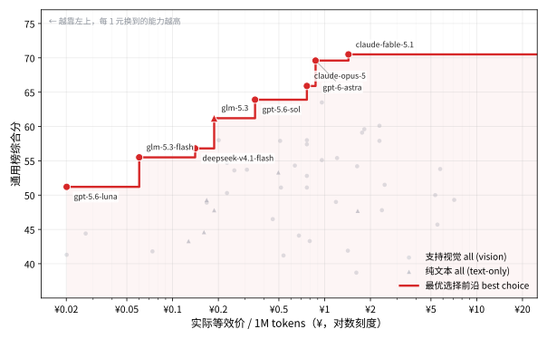
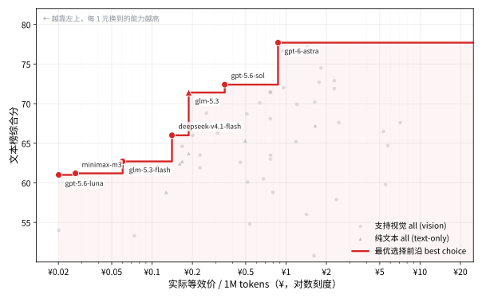

# AI 前沿模型排行 LLM Leaderboard：通用 / 写作 / 性价比三榜

精选 50 个主流旗舰大模型，针对三大真实需求提供三张榜单：
- **干重活与写代码（通用榜）**：看编程、智能体、复杂逻辑与长上下文能力（当前 claude-fable-5.1 第一，70.5 分）；
- **写文章与专业案头（文本榜）**：看创意写作、文风质感、长文阅读与日常问答（当前 gpt-6-astra 第一，77.7 分）；
- **算钱包与真实花销（性价比榜）**：看折算真实订阅套餐与 API 折扣后的到手单价（订阅折算后最低约 $0.005/M）。

数据来自 LiveBench、DeepSWE、EQ-Bench、Artificial Analysis 四个独立评测的交叉聚合，不是某一家的一家之言；价格同时标注美元与人民币，每月随上游自动更新。

## 能力-成本曲线：预算多少，买哪个模型

怎么看图：在横轴定位你的预算，红色阶梯线上对应的模型就是这个预算里最聪明的选择（前沿高度即该预算能买到的最强综合能力）。

每个点代表一个模型：横轴是实际支付价（最优订阅套餐折算后的等效价，无订阅厂商按官方按量混合价；人民币、对数刻度），纵轴是通用榜综合分。当前前沿自左向右依次是 gpt-5.4-nano、minimax-m3、glm-5.3-flash、gpt-5.6-terra、glm-5.3、gpt-5.6-sol、claude-opus-5、gpt-6-astra，终点是 claude-fable-5.1。

<!--FRONTIER_START-->

<!--FRONTIER_END-->

## 这个榜单怎么做

大多数公开榜单要么只看一家的合成指数，要么把几百个长尾模型堆在一起凑数。这里的做法基于四条硬核事实：

- **只挑主力旗舰（50 个），不堆长尾**：覆盖国际主流与国内主力厂商，每家只收录当家版本，剔除重复变体与弃用条目，避免稀释参考价值。
- **四个独立源交叉验证**：全面聚合 LiveBench、DeepSWE、EQ-Bench 与 Artificial Analysis，用多方独立跑分抵消单源偏见。
- **算真实到手价（实付成本与 90% 缓存命中）**：结合各家实际订阅套餐折扣与 90% 缓存命中率折算等效单价，美元与人民币双币价由实时汇率驱动。
- **固定理论锚点打分**：按各项指标理论范围换算 0-100 分，不做「样本第一 = 100」的相对名次分。新增模型不影响已有分数，真实反映能力代差。

## 通用榜 Top 15

编程、智能体、日常混合使用看这张。权重：代码与 Agent 35%（Terminal-Bench v4.0 45%、DeepSWE 35%、LiveBench Coding 20%）、业务自动化 15%、指令遵循与长上下文 20%、科学与推理 20%、事实准确性 10%。

<!--SNAPSHOT_GENERAL_START-->
> 2026-10-02 数据（58 精选模型 -> 58 行；日期为上游抓取实际时点，stale 构建不刷新）。
> 填补验证：Terminal-Bench v4.0 MAE=0.08 (>10%: 84.0%/50) ; DeepSWE MAE=8.65 (>10%: 53.6%/28) ; LiveBench Coding MAE=3.32 (>10%: 7.1%/56) ; tau3-Banking MAE=0.05 (>10%: 61.7%/47) ; LiveBench Data Analysis MAE=5.00 (>10%: 16.1%/56) ; LiveBench Agentic Coding MAE=3.99 (>10%: 30.4%/56) ; LiveBench Instruction Following MAE=2.25 (>10%: 0.0%/56) ; LCR MAE=0.02 (>10%: 0.0%/58) ; HLE MAE=0.03 (>10%: 22.4%/58) ; SciCode MAE=0.02 (>10%: 4.0%/50) ; LiveBench Reasoning MAE=3.08 (>10%: 5.4%/56) ; Omniscience Index MAE=15.19 (>10%: 98.3%/58)
<!--SNAPSHOT_GENERAL_END-->

<!--TOP15_GENERAL_START-->
| # | Model | Creator | Vision | Score | Imputed |
|---|---|---|---|---|---|
| 1 | claude-opus-5.5 | Anthropic | 👁️ | 72.0 | DeepSWE(reg), tau3-Banking(reg) |
| 2 | claude-fable-5.1 | Anthropic | 👁️ | 70.5 | DeepSWE(reg) |
| 3 | gpt-6-astra | OpenAI | 👁️ | 69.6 | - |
| 4 | gpt-6.1-sol | OpenAI | 👁️ | 68.2 | DeepSWE(reg), tau3-Banking(reg) |
| 5 | claude-fable-5 | Anthropic | 👁️ | 67.1 | - |
| 6 | claude-sonnet-5.5 | Anthropic | 👁️ | 67.0 | DeepSWE(reg), tau3-Banking(reg) |
| 7 | claude-opus-5 | Anthropic | 👁️ | 65.9 | - |
| 8 | gpt-5.6-sol | OpenAI | 👁️ | 63.9 | - |
| 9 | gpt-6-sol | OpenAI | 👁️ | 63.6 | DeepSWE(reg), tau3-Banking(reg) |
| 10 | muse-spark-1.3 | Meta | 👁️ | 63.4 | DeepSWE(reg) |
| 11 | glm-5.3 | Z.AI | - | 61.2 | - |
| 12 | gemini-3.8-flash | Google | 👁️ | 60.1 | - |
| 13 | grok-4.6 | xAI | 👁️ | 59.6 | - |
| 14 | claude-opus-4.7 | Anthropic | 👁️ | 59.5 | Terminal-Bench v4.0(reg), DeepSWE(reg), SciCode(reg) |
| 15 | qwen3.8-max | Alibaba | 👁️ | 59.3 | - |
<!--TOP15_GENERAL_END-->

[完整排名 CSV](results/general_scored.csv)

## 文本榜 Top 15

适用于文学创作、长篇阅读、专业案头分析与日常问答。评测覆盖 5 个维度：创意文学 25%（StoryGen 55%、Language 45%）、专业案头 20%（AA-Briefcase 50%、Data Analysis 25%、Summarize 25%）、指令约束 20%、事实与长文本 20%、人际心智 15%。不包含代码生成与数理考试指标。图表纵轴为文本榜综合分，横轴为百万 token 成本，用于按预算选型。

<!--TEXT_FRONTIER_START-->

<!--TEXT_FRONTIER_END-->

<!--SNAPSHOT_TEXT_START-->
> 2026-10-02 数据（58 精选模型 -> 58 行；日期为上游抓取实际时点，stale 构建不刷新）。
> 填补验证：LiveBench StoryGen MAE=4.49 (>10%: 17.9%/56) ; LiveBench Language MAE=4.46 (>10%: 16.1%/56) ; AA-Briefcase MAE=240.97 (>10%: 62.7%/51) ; LiveBench Data Analysis MAE=5.00 (>10%: 16.1%/56) ; LiveBench Summarize MAE=7.40 (>10%: 42.9%/56) ; LiveBench Instruction Following MAE=2.25 (>10%: 0.0%/56) ; LiveBench Simplify MAE=2.27 (>10%: 0.0%/56) ; Omniscience Index MAE=15.19 (>10%: 98.3%/58) ; LCR MAE=0.02 (>10%: 0.0%/58) ; Omniscience Non-Halluc. MAE=0.19 (>10%: 86.2%/58) ; LiveBench Theory of Mind MAE=4.54 (>10%: 8.9%/56) ; CritPt MAE=0.06 (>10%: 84.5%/58)
<!--SNAPSHOT_TEXT_END-->

<!--TOP15_TEXT_START-->
| # | Model | Creator | Vision | Score | Imputed |
|---|---|---|---|---|---|
| 1 | gpt-6-astra | OpenAI | 👁️ | 77.7 | - |
| 2 | claude-fable-5.1 | Anthropic | 👁️ | 77.3 | - |
| 3 | gpt-6.1-sol | OpenAI | 👁️ | 77.3 | - |
| 4 | claude-fable-5 | Anthropic | 👁️ | 76.9 | - |
| 5 | muse-spark-1.3 | Meta | 👁️ | 76.7 | - |
| 6 | grok-4.7 | xAI | 👁️ | 75.7 | - |
| 7 | claude-opus-5.5 | Anthropic | 👁️ | 75.4 | - |
| 8 | grok-4.6 | xAI | 👁️ | 74.5 | - |
| 9 | qwen3.8-max | Alibaba | 👁️ | 73.1 | - |
| 10 | gemini-3.8-flash | Google | 👁️ | 72.9 | - |
| 11 | kimi-k3 | Moonshot AI | 👁️ | 72.7 | - |
| 12 | gpt-5.6-sol | OpenAI | 👁️ | 72.5 | - |
| 13 | gpt-6-sol | OpenAI | 👁️ | 72.1 | - |
| 14 | muse-spark-1.2 | Meta | 👁️ | 71.9 | - |
| 15 | gemini-3.7-flash | Google | 👁️ | 71.8 | - |
<!--TOP15_TEXT_END-->

[完整排名 CSV](results/text_scored.csv)

## 性价比榜 Top 15

回答「买哪个套餐最划算」。行序跟通用榜一致——按性价比排会让便宜小模型霸榜，没有决策价值。各列含义：API $/1M 是官方按量混合价（含缓存命中假设）；套餐内 $/1M 是该厂商最优订阅折算后的等效价；倍率是每 1 元月费换到的 API 等价额度，70× 即 $1 月费约换 $70 额度；Value = 综合分 ÷ 套餐内 $/1M。套餐名就是官方购买链接，没有订阅制的厂商按 API 按量计费（1×）。

<!--SNAPSHOT_VALUE_START-->
> 2026-10-02 数据（58 精选模型 -> 58 行；日期为上游抓取实际时点，stale 构建不刷新）。
> 填补验证：Terminal-Bench v4.0 MAE=0.08 (>10%: 84.0%/50) ; DeepSWE MAE=8.65 (>10%: 53.6%/28) ; LiveBench Coding MAE=3.32 (>10%: 7.1%/56) ; tau3-Banking MAE=0.05 (>10%: 61.7%/47) ; LiveBench Data Analysis MAE=5.00 (>10%: 16.1%/56) ; LiveBench Agentic Coding MAE=3.99 (>10%: 30.4%/56) ; LiveBench Instruction Following MAE=2.25 (>10%: 0.0%/56) ; LCR MAE=0.02 (>10%: 0.0%/58) ; HLE MAE=0.03 (>10%: 22.4%/58) ; SciCode MAE=0.02 (>10%: 4.0%/50) ; LiveBench Reasoning MAE=3.08 (>10%: 5.4%/56) ; Omniscience Index MAE=15.19 (>10%: 98.3%/58)
<!--SNAPSHOT_VALUE_END-->

<!--TOP15_VALUE_START-->
| # | Model | Creator | Vision | Score | API $/1M | 套餐 | 月费 | 倍率 | 套餐内 $/1M | 套餐内 ¥/1M | Value |
|---|---|---|---|---|---|---|---|---|---|---|---|
| 1 | claude-opus-5.5 | Anthropic | 👁️ | 72.0 | 3.493 | [Claude Max 20x](https://claude.com/pricing) | $200 | 40× | 0.087 | 0.583 | 827.95 |
| 2 | claude-fable-5.1 | Anthropic | 👁️ | 70.5 | 8.541 | [Claude Max 20x](https://claude.com/pricing) | $200 | 40× | 0.214 | 1.434 | 329.44 |
| 3 | gpt-6-astra | OpenAI | 👁️ | 69.6 | 9.115 | [ChatGPT Pro 20x](https://chatgpt.com/pricing) | $200 | 70× | 0.13 | 0.871 | 535.73 |
| 4 | gpt-6.1-sol | OpenAI | 👁️ | 68.2 | 1.746 | [ChatGPT Pro 20x](https://chatgpt.com/pricing) | $200 | 70× | 0.025 | 0.168 | 2729.06 |
| 5 | claude-fable-5 | Anthropic | 👁️ | 67.1 | 9.115 | [Claude Max 20x](https://claude.com/pricing) | $200 | 40× | 0.228 | 1.528 | 294.3 |
| 6 | claude-sonnet-5.5 | Anthropic | 👁️ | 67.0 | 1.823 | [Claude Max 20x](https://claude.com/pricing) | $200 | 40× | 0.046 | 0.308 | 1457.11 |
| 7 | claude-opus-5 | Anthropic | 👁️ | 65.9 | 4.558 | [Claude Max 20x](https://claude.com/pricing) | $200 | 40× | 0.114 | 0.764 | 578.5 |
| 8 | gpt-5.6-sol | OpenAI | 👁️ | 63.9 | 3.646 | [ChatGPT Pro 20x](https://chatgpt.com/pricing) | $200 | 70× | 0.052 | 0.348 | 1228.82 |
| 9 | gpt-6-sol | OpenAI | 👁️ | 63.6 | 1.823 | [ChatGPT Pro 20x](https://chatgpt.com/pricing) | $200 | 70× | 0.026 | 0.174 | 2444.77 |
| 10 | muse-spark-1.3 | Meta | 👁️ | 63.4 | 0.858 | [OpenCode Go](https://opencode.ai/go) | $10 | 6× | 0.143 | 0.958 | 443.37 |
| 11 | glm-5.3 | Z.AI | - | 61.2 | 0.978 | [GLM Coding Plan Max](https://bigmodel.cn/glm-coding) | $149.7 | 34.4× | 0.028 | 0.188 | 2184.42 |
| 12 | gemini-3.8-flash | Google | 👁️ | 60.1 | 0.684 | [GitHub Copilot Max](https://github.com/features/copilot/plans) | $100 | 2× | 0.342 | 2.292 | 175.87 |
| 13 | grok-4.6 | xAI | 👁️ | 59.6 | 1.452 | [SuperGrok Heavy](https://x.ai/pricing) | $300 | 5.3× | 0.272 | 1.823 | 219.26 |
| 14 | claude-opus-4.7 | Anthropic | 👁️ | 59.5 | 4.558 | [Claude Max 20x](https://claude.com/pricing) | $200 | 40× | 0.114 | 0.764 | 521.91 |
| 15 | qwen3.8-max | Alibaba | 👁️ | 59.3 | 1.261 | [Command Code GOAT](https://commandcode.ai) | $10 | 7× | 0.18 | 1.206 | 329.25 |
<!--TOP15_VALUE_END-->

[完整排名 CSV](results/value_scored.csv)

Imputed 列：`-` 表示全部真实值，`指标(reg)` 是岭回归填补，`指标(reg,low)` 是低可信填补。性价比榜完整 CSV 里还有 `Blended $/1M`（无折扣混合价）和 `Plan Monthly / Multiplier / Discount / URL` 等套餐明细列。

## 套餐购买指南

按订阅维度直接对比「买哪家最值」。每个套餐取它覆盖的厂商里通用榜最强的模型，按「套餐内 Value = 最强模型分 ÷ 该套餐下等效价」从高到低排。这个排法同时反映两件事：套餐能用到多强的模型、折算后到底多便宜，不是单纯比谁额度大。

各列口径：

- 倍率 = 每 1 元月费换到的 API 等价额度；折扣 = 套餐内单价 ÷ 官方单价
- ≈Token/月：官方公布了 token 池的直接引用（MiniMax、GLM、混元、MiMo）；没公布的按「API 等价价值 ÷ 最强模型官方混合价」估算，即额度全部用于该模型时的量，实际用便宜模型能换到更多

数据来源与时点：ChatGPT / Claude 倍率来自 SemiAnalysis 2026-06 实测，Copilot 是 GitHub 官方额度，Grok 为 agentplans.fyi 2026-06 估算，Kimi/MiMo 为 2026-09 官方页面实查，国内各家与聚合/Coding Plan 类（火山方舟、Ollama Pro、Command Code、R4 Coder、OpenCode Go、Windsurf、Cursor 等）按 2026-09 官方常规长期标价（不计限时活动）核验。倍率一律按用满额度上限计算，轻度用户实际拿不到这么多。国内套餐标价为人民币，¥/月 按实时汇率折算。

积分制套餐没有倍率。千问 Token Plan、Poe 和 WorkBuddy 官方都没公布 Credits 换 token 的系数，社区两套口径相差 5 到 10 倍，给数字等于编数，所以只列官方积分额度；WorkBuddy 的 token 量按社区实测「1 积分 ≈ 4,100 token」折了个大概，仅供参考。

两个例外。Gemini 官方订阅不含 API 额度，不进表，编程需求可以由 GitHub Copilot 覆盖；DeepSeek 没有自有订阅制，由火山方舟 Coding Plan 等第三方聚合池提供折扣（详见 FAQ）。

<!--PLANS_GUIDE_START-->
| # | 套餐 | 月费 | ¥/月 | 倍率 | 折扣 | ≈Token/月 | 最强模型（通用榜） | 模型分 | 套餐内 $/1M | Value |
|---|---|---|---|---|---|---|---|---|---|---|
| 1 | [MiniMax Max Token Plan](https://platform.minimaxi.com/subscribe/token-plan) | $16.5 | ¥111 | 66.3× | 1.5% | 18亿+ | minimax-m3 (#50) | 44.1 | 0.004 | 11635.6 |
| 2 | [MiniMax Ultra Token Plan](https://platform.minimaxi.com/subscribe/token-plan) | $65.1 | ¥436 | 66.3× | 1.5% | 71亿+ | minimax-m3 (#50) | 44.1 | 0.004 | 11635.6 |
| 3 | [MiniMax Plus Token Plan](https://platform.minimaxi.com/subscribe/token-plan) | $6.8 | ¥46 | 53.7× | 1.9% | 6亿+ | minimax-m3 (#50) | 44.1 | 0.005 | 9446.1 |
| 4 | [GLM Coding Plan Max](https://bigmodel.cn/glm-coding) | $149.7 | ¥1003 | 34.4× | 2.9% | ≈29.3~58.6亿/月 | glm-5.3 (#11) | 61.2 | 0.028 | 2157.8 |
| 5 | [OpenCode Go](https://opencode.ai/go) | $10 | ¥67 | 6× | 16.7% | $60/月（$60 档模型） | hy3 (#52) | 43.3 | 0.021 | 2057.8 |
| 6 | [GLM Coding Plan Pro](https://bigmodel.cn/glm-coding) | $74.7 | ¥501 | 29.6× | 3.4% | ≈12.6~25.1亿/月 | glm-5.3 (#11) | 61.2 | 0.033 | 1840.5 |
| 7 | [GLM Coding Plan Lite](https://bigmodel.cn/glm-coding) | $16.4 | ¥110 | 22.4× | 4.5% | ≈2.1~4.2亿/月 | glm-5.3 (#11) | 61.2 | 0.044 | 1390.6 |
| 8 | [Claude Max 20x](https://claude.com/pricing) | $200 | ¥1340 | 40× | 2.5% | ≈23亿 | claude-opus-5.5 (#1) | 72.0 | 0.087 | 824.5 |
| 9 | [ChatGPT Pro 20x](https://chatgpt.com/pricing) | $200 | ¥1340 | 70× | 1.4% | ≈15亿 | gpt-6-astra (#3) | 69.6 | 0.13 | 534.0 |
| 10 | [Hy Token Plan Max](https://cloud.tencent.com/act/pro/tokenplan) | $65 | ¥436 | 1.4× | 73.5% | 6.5亿/月 | hy3 (#52) | 43.3 | 0.093 | 467.6 |
| 11 | [Hy Token Plan Pro](https://cloud.tencent.com/act/pro/tokenplan) | $33.06 | ¥222 | 1.3× | 76.0% | 3.2亿/月 | hy3 (#52) | 43.3 | 0.096 | 452.2 |
| 12 | [Hy Token Plan Standard](https://cloud.tencent.com/act/pro/tokenplan) | $10.83 | ¥73 | 1.3× | 79.0% | 1亿/月 | hy3 (#52) | 43.3 | 0.1 | 435.0 |
| 13 | [Hy Token Plan Lite](https://cloud.tencent.com/act/pro/tokenplan) | $3.9 | ¥26 | 1.2× | 81.0% | 3500万/月 | hy3 (#52) | 43.3 | 0.102 | 424.3 |
| 14 | [Claude Max 5x](https://claude.com/pricing) | $100 | ¥670 | 20× | 5.0% | ≈6亿 | claude-opus-5.5 (#1) | 72.0 | 0.175 | 412.3 |
| 15 | [Claude Pro](https://claude.com/pricing) | $20 | ¥134 | 20× | 5.0% | ≈1亿 | claude-opus-5.5 (#1) | 72.0 | 0.175 | 412.3 |
| 16 | [MiMo Token Plan Max](https://mimo.mi.com/docs/zh-CN/price/token-plan) | $100 | ¥670 | 1.3× | 79.0% | ≈4.5亿/月 | mimo-v2.5-pro (#49) | 44.5 | 0.134 | 331.3 |
| 17 | [MiMo Token Plan Pro](https://mimo.mi.com/docs/zh-CN/price/token-plan) | $50 | ¥335 | 1.2× | 82.6% | ≈2.1亿/月 | mimo-v2.5-pro (#49) | 44.5 | 0.14 | 316.8 |
| 18 | [MiMo Token Plan Standard](https://mimo.mi.com/docs/zh-CN/price/token-plan) | $16 | ¥107 | 1.1× | 91.4% | ≈6200万/月 | mimo-v2.5-pro (#49) | 44.5 | 0.155 | 286.3 |
| 19 | [MiMo Token Plan Lite](https://mimo.mi.com/docs/zh-CN/price/token-plan) | $6 | ¥40 | 1.1× | 94.0% | ≈2300万/月 | mimo-v2.5-pro (#49) | 44.5 | 0.16 | 278.5 |
| 20 | [ChatGPT Pro 5x](https://chatgpt.com/pricing) | $100 | ¥670 | 35× | 2.9% | ≈4亿 | gpt-6-astra (#3) | 69.6 | 0.261 | 267.0 |
| 21 | [ChatGPT Plus](https://chatgpt.com/pricing) | $20 | ¥134 | 35× | 2.9% | ≈0.8亿 | gpt-6-astra (#3) | 69.6 | 0.261 | 267.0 |
| 22 | [Kimi Allegro](https://www.kimi.com/membership/pricing) | $97.08 | ¥650 | 10.4× | 9.6% | 周240M uncached in/out | kimi-k3 (#16) | 59.1 | 0.263 | 224.5 |
| 23 | [SuperGrok Heavy](https://x.ai/pricing) | $300 | ¥2010 | 5.3× | 18.8% | ≈11亿 | grok-4.6 (#13) | 59.6 | 0.272 | 218.9 |
| 24 | [SuperGrok](https://x.ai/pricing) | $30 | ¥201 | 5.3× | 18.8% | ≈1亿 | grok-4.6 (#13) | 59.6 | 0.272 | 218.9 |
| 25 | [Kimi Moderato](https://www.kimi.com/membership/pricing) | $13.75 | ¥92 | 4.9× | 20.5% | 周16M uncached in/out | kimi-k3 (#16) | 59.1 | 0.559 | 105.7 |
| 26 | [Kimi 会员 Allegretto](https://www.kimi.com/membership/pricing) | $27.6 | ¥185 | 4.5× | 22.0% | ≈0.5亿 | kimi-k3 (#16) | 59.1 | 0.601 | 98.3 |
| 27 | [Kimi Andante](https://www.kimi.com/membership/pricing) | $6.8 | ¥46 | 2.5× | 40.5% | 周4M uncached in/out | kimi-k3 (#16) | 59.1 | 1.107 | 53.4 |
| 28 | [Factory Droid Pro](https://factory.ai) | $20 | ¥134 | 2.4× | 41.7% | 2000万标准token | claude-opus-5.5 (#1) | 72.0 | 1.457 | 49.4 |
| 29 | [GitHub Copilot Max](https://github.com/features/copilot/plans) | $100 | ¥670 | 2× | 50.0% | ≈0.6亿 | claude-opus-5.5 (#1) | 72.0 | 1.746 | 41.2 |
| 30 | [Trae Pro](https://www.trae.ai) | $10 | ¥67 | 2× | 50.0% | $20 基础用量 | claude-opus-5.5 (#1) | 72.0 | 1.746 | 41.2 |
| 31 | [Cursor Ultra](https://cursor.com/pricing) | $200 | ¥1340 | 2× | 50.0% | $400 API 用量 | claude-opus-5.5 (#1) | 72.0 | 1.746 | 41.2 |
| 32 | [GitHub Copilot Pro+](https://github.com/features/copilot/plans) | $39 | ¥261 | 1.8× | 55.7% | ≈0.2亿 | claude-opus-5.5 (#1) | 72.0 | 1.946 | 37.0 |
| 33 | [Windsurf Pro](https://codeium.com/windsurf) | $15 | ¥101 | 1.7× | 60.0% | 500 prompt credits/月 | claude-opus-5.5 (#1) | 72.0 | 2.096 | 34.4 |
| 34 | [GitHub Copilot Pro](https://github.com/features/copilot/plans) | $10 | ¥67 | 1.5× | 66.7% | ≈4M | claude-opus-5.5 (#1) | 72.0 | 2.33 | 30.9 |
| 35 | [Cursor Pro+](https://cursor.com/pricing) | $60 | ¥402 | 1.2× | 85.7% | $70 API 用量 | claude-opus-5.5 (#1) | 72.0 | 2.994 | 24.0 |
| | *—— 以下为积分/任务制套餐（官方未公布 Credits→token 换算，不参与倍率排序）——* | | | | | | | | | |
| 36 | [Qwen Token Plan Lite](https://platform.qianwenai.com/pricing/token-plan) | $5.4 | ¥36 | - | - | 2,500 Credits/7天 | qwen3.8-max (#15) | 59.3 | 1.261 | 47.0 |
| 37 | [WorkBuddy 标准版](https://www.workbuddy.cn/docs/workbuddy/Pricing) | $13.8 | ¥92 | - | - | ≈1600万/月 | hy3 (#52) | 43.3 | 0.126 | 343.7 |
| 38 | [Qwen Token Plan Standard](https://platform.qianwenai.com/pricing/token-plan) | $19.3 | ¥129 | - | - | 10,000 Credits/7天 | qwen3.8-max (#15) | 59.3 | 1.261 | 47.0 |
| 39 | [Poe Premium](https://poe.com) | $19.99 | ¥134 | - | - | 660,000 计算积分/月 | claude-opus-5.5 (#1) | 72.0 | 3.493 | 20.6 |
| 40 | [Cursor Pro](https://cursor.com/pricing) | $20 | ¥134 | - | - | $20 API 用量 | claude-opus-5.5 (#1) | 72.0 | 3.493 | 20.6 |
| 41 | [WorkBuddy 高级版](https://www.workbuddy.cn/docs/workbuddy/Pricing) | $27.6 | ¥185 | - | - | ≈3700万/月 | hy3 (#52) | 43.3 | 0.126 | 343.7 |
| 42 | [Qwen Token Plan Pro](https://platform.qianwenai.com/pricing/token-plan) | $69.3 | ¥464 | - | - | 40,000 Credits/7天 | qwen3.8-max (#15) | 59.3 | 1.261 | 47.0 |
| 43 | [WorkBuddy 旗舰版](https://www.workbuddy.cn/docs/workbuddy/Pricing) | $138.8 | ¥930 | - | - | ≈2亿/月 | hy3 (#52) | 43.3 | 0.126 | 343.7 |
<!--PLANS_GUIDE_END-->

---

## 数据源

| 源 | 测什么 | 维护方 | 抗污染 |
|---|---|---|---|
| [LiveBench](https://livebench.ai) | 编码 / Agentic Coding / 指令遵循 / 语言 | Abacus.AI + 学界 | ✅ 半年刷新 |
| [DeepSWE](https://deepswe.datacurve.ai) | 长程软件工程 agent | Datacurve | ✅ 原创任务 |
| [EQ-Bench](https://eqbench.com) | 创意写作 | 独立（LLM-judge） | ⚠️ 主观维度 |
| [Artificial Analysis](https://artificialanalysis.ai) | 真实终端操作 (Terminal-Bench v4.0) / 金融业务与 Agent 工具 (tau3-Banking) / 专业案头 (Briefcase) / 超长文本与事实抗伪 | 独立评测机构 | ✅ 第三方统一跑分 |
| [Frankfurter](https://frankfurter.dev) | USD→CNY 汇率（ECB 官方） | 开源 | — |

## 权重与打分

固定锚点打分：每项指标按理论范围换算到 0-100 分，再按权重加权。

- 通用榜：代码与 Agent 35%、业务自动化 15%、指令遵循与长上下文 20%、科学与推理 20%、事实准确性 10%
- 文本榜：创意文学 25%、专业案头 20%、指令约束 20%、事实与长文本 20%、人际心智 15%
- 性价比榜：与通用榜同权重同名次，展示官方 API 价与最优订阅折算价（含倍率和购买链接），Value = 综合分 ÷ 套餐内 $/1M；配套的套餐购买指南按套餐内性价比排序

[完整方法论](METHODOLOGY.md)

## FAQ

**我是小白或普通用户，写文章、查资料该怎么选？**

直接看文本榜。目前综合表现最好的是 gpt-6-astra 与 claude-fable 系列；预算敏感或日常写材料，国产的 kimi-k3、glm-5.3 以及 gemini-flash 系列在保持高分的同时更具成本优势。

**写代码、干复杂任务选 Claude 还是 GPT？**

通用榜上 claude-fable-5.1（70.5）与 gpt-6-astra（69.6）同属第一梯队，差距小于 1 分。关键看实付花销：ChatGPT Pro 20x 搭配 GPT 系折算后约 $0.13/M，Claude Max 20x 搭配 Claude 系约 $0.21/M。如果追求极致工程执行力选 Claude，追求性价比与速度选 GPT。

**国产模型（DeepSeek、Kimi、GLM、Qwen）现在什么水平？**

通用榜前十有两个国产：glm-5.3 第 7（61.2）、kimi-k3 第 10（59.1）。国产的最大优势在官方套餐折扣：例如 GLM Coding Plan Max 折后约 $0.028/M，单价仅为国际旗舰的十分之一左右。

**套餐“倍率”是什么意思？我怎么拿到这个折扣？**

倍率是“每花 1 元月费能换到的官方 API 等价额度”。例如 ChatGPT Pro 20x 倍率 70×，等于用满额度相当于 1.4 折；GLM Coding Plan Max 倍率 34.4× 相当于 2.9 折。注意这是按用满额度上限测算，轻度偶尔使用的用户实际折扣会更低。

**为什么很多免费小模型或旧模型不在榜单里？**

几百个开源小模型或旧代模型在日常复杂任务中已被淘汰或表现断层。榜单坚持精选各家主力旗舰（50 个），帮助用户直奔有效选项，不做长尾无意义堆量。

**DeepSeek 怎么用最划算？**

DeepSeek 官方只提供 API 按量计费，没有自有订阅会员制。如果习惯用第三方 IDE 或聚合客户端，可通过聚合类 Coding Plan（如火山方舟等）获取多模型阶梯折扣；直接调用官方 API 则享有本身极低的官方混合价。

## 复现

```bash
pip install -r requirements.txt
python scripts/build.py            # 完整构建（抓取 + 合并 + 评分 + README）
python scripts/build.py --offline  # 离线复算缓存
python -m pytest -q                # 测试
```

GitHub Actions 每月 1 号自动更新。

## License

评分脚本与整理结果：MIT。原始数据版权归各基准维护方。
